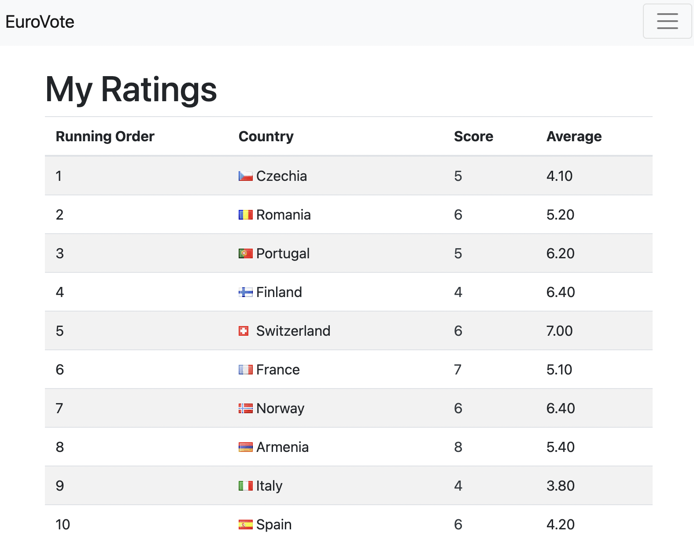

# Eurovote


A voting app for the Eurovision Song Contest. Host the Django Web App to let your friends and family rate each finalist out of 10.

## Installation

Use the package manager [pip](https://pip.pypa.io/en/stable/) to install the dependencies.

```
pip install -r requirements.txt
```


Create a *'.env'* file with the following keys:

```
DJANGO_SECRET_KEY=...
DEBUG=true/false
DEVELOPMENT=true/false
```

Migrate the local SQLite database.
```
python manage.py migrate
```
Run the web application
```
python manage.py runserver
```

## Features

- User authentication system (login/logout/register)
- Set countries and their running order
- Rate each country out of 10
- View other users' ratings



## Contributing
Pull requests are welcome. For major changes, please open an issue first to discuss what you would like to change.

Please make sure to update tests as appropriate.

## License
[MIT](https://choosealicense.com/licenses/mit/)