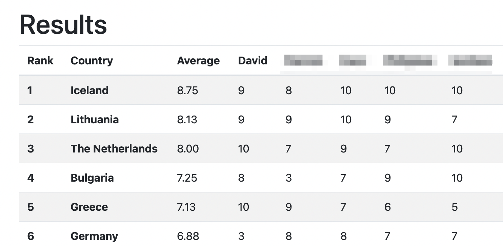

# django-euro-vote
A Django Web App that let's friends and family vote in a group for the Eurovision Song Contest.

Vote out of 10 and find out the group favourite


## How to run
Install requirements.txt
```
pip install -r requirements.txt
```
Run the web app
```
python django_euro_vote/manage.py runserver
```
Open the website in a web browser
```
http://localhost:8000/
```
Login using superuser or make an acccount
```
username: admin
password: admin
```
Add the countries and running orders, run the server, share the link, get voting!

## Additional Features
Prevent additional users from signing up by opening http://localhost:8000/admin > settings > Setting object (1) > untick the box
